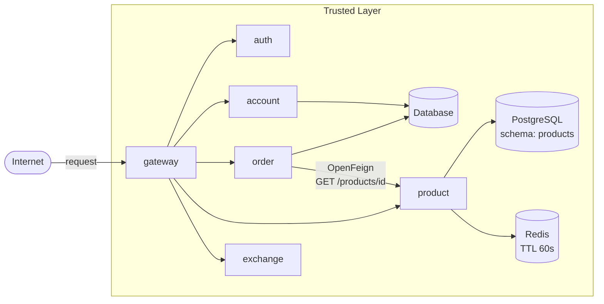
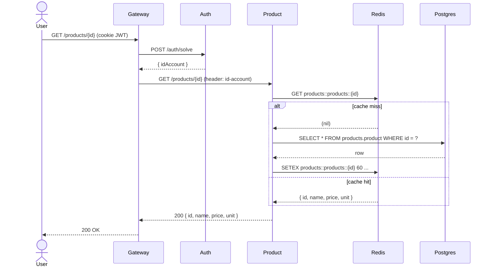

# Product API

**Aluno:** Carlos Hernani
**Grupo:** Alex Chequer, Carlos Hernani, Lucas Ikawa  
**Disciplina:** Plataformas, Microserviços e APIs — Insper 2026.1  
**Instrutor:** Humberto Sandmann

---

## Sobre o projeto

O projeto é uma aplicação web que permite aos usuários comprar e vender produtos em diferentes moedas. Cada membro do grupo implementa ao menos um microserviço. Este repositório contém a **Product API**, responsável pelo catálogo de produtos da loja — criação, listagem (com busca por nome), consulta e remoção. O `order-service` a consome via OpenFeign para resolver os itens de um pedido.

## Entregas

| Atividade | Status | Repositório |
|-----------|--------|-------------|
| Product API | ✅ Concluído | [Microservice-Alex-Carlos-Lucas/product-service](https://github.com/Microservice-Alex-Carlos-Lucas/product-service) |
| Bottleneck 1 — Caching | ✅ Documentado | [Bottlenecks](bottlenecks.md) |
| Bottleneck 2 — Observabilidade | ✅ Documentado | [Bottlenecks](bottlenecks.md) |
| Bottlenecks (medidos) | ✅ 3× speedup com Redis cache | [Bottlenecks](bottlenecks.md) |
| Deploy em EKS + HPA | ✅ Cluster `store-cluster` (us-east-1) | [Architecture](architecture.md) |
| Pipeline Jenkins (Build → Push → Deploy) | ✅ | [Development](development.md) |

## Repositórios

| Serviço | Repositório |
|---------|-------------|
| Product API (este) | [Microservice-Alex-Carlos-Lucas/product-service](https://github.com/Microservice-Alex-Carlos-Lucas/product-service) |
| Plataforma (raiz) | [Microservice-Alex-Carlos-Lucas/microservices](https://github.com/Microservice-Alex-Carlos-Lucas/microservices) |
| Exchange API | [Microservice-Alex-Carlos-Lucas/exchange](https://github.com/Microservice-Alex-Carlos-Lucas/exchange) |
| Order API | [Microservice-Alex-Carlos-Lucas/order-service](https://github.com/Microservice-Alex-Carlos-Lucas/order-service) |

## Arquitetura geral

## Diagrama de sequência — Product API

